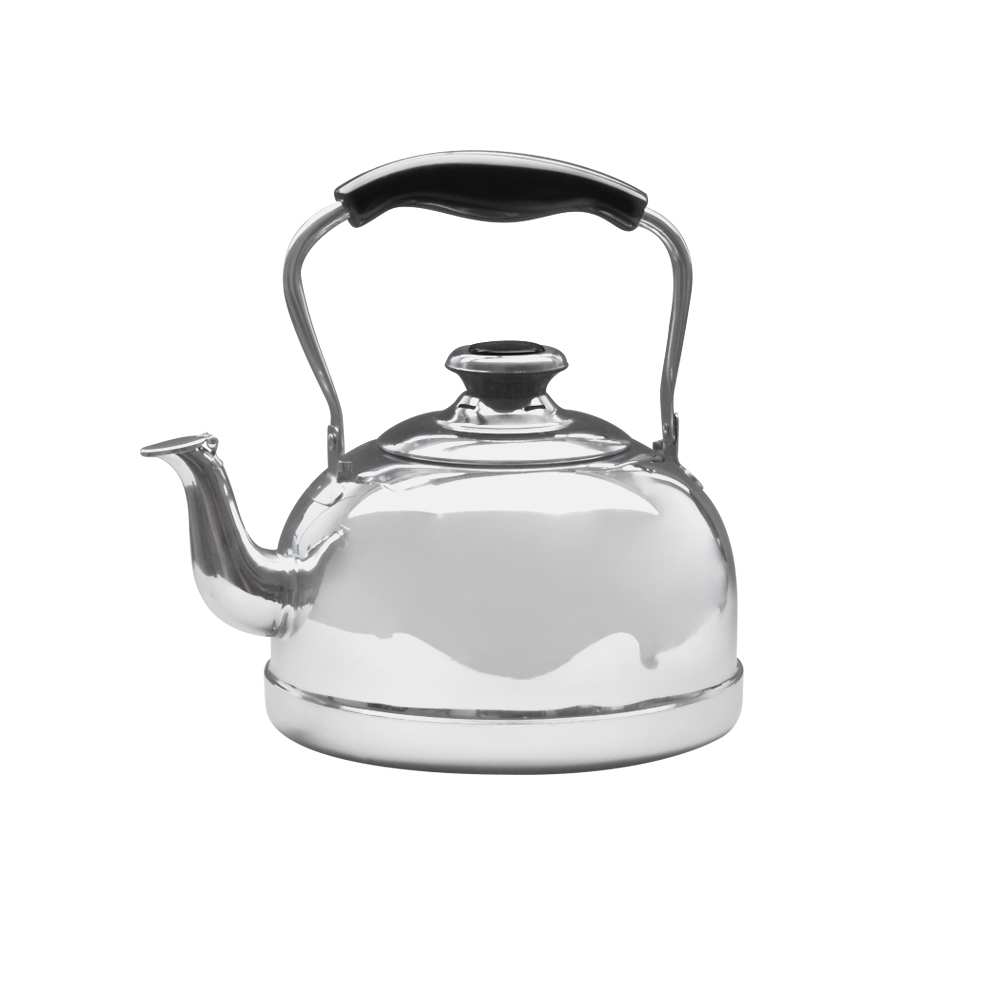

### Прогнать любую open source криптографическую библиотеку через статический анализатор. Пошаговое руководство для чайников. 

1. Открываем [репозиторий](https://github.com/sobolevn/awesome-cryptography) со списоком криптографических библиотек на всех языках 
мира.
2. Выбираем любую. (Когда вы выбрали библиотеку, то теперь библиотека должна выбрать вас)
3. Выбираем из списка ниже SAST (статический анализатор), либо ищем другой, 
если по какой то причине никто из списка ниже не подходит. Будет хорошо, если поделитесь с остальными, 
что в итоге использовали. 
4. Запускаем анализатор (везде по разному)
5. Фоткаем вывод с ошибками безопасности
6. Смотрим как выглядит интерфейс библиотеки (точки вызова функций библиотеки), 
пробуем вызывать ошибки, описываем как выглядит обработка ошибок от библиотеки.
7. Собираем фотографии и свои рассуждения из п.6 в отчет и отправляем.

###### SAST, которые я успел потрогать

- `clang-tidy` - анализатор с [лабы Тимакова](https://github.com/O33ero/scan-coturn), **крайне рекомендую**
- `scan-build` - анализатор с [лабы Тимакова](https://github.com/O33ero/scan-coturn), **крайне рекомендую**
- `PVS-Studio` - дробовик среди рогаток, нужна лицензия, FREE trial хрен пойми как работает, **не рекомендую**, есть плагин для IDEA
- `JFrog Xray` - нужна регистрация и поднятия Cloud Environment (закалебешься настраивать), до конца не добрался, но должно работать, есть плагин для IDEA, **стоит попробовать**
- `SonarLint,SonarCube` - нужна лицензия, особо не разбирался
- `Snyk`([Шнюк](https://s27.ucoz.net/video/28/28438336.jpg)) - не нужна лицензия, есть плагин для IDEA, почему то тупит на некоторых проектах, **рекомендую**
- `Bearer` - легковесный анализатор, ставится в два клика, не очень мощный, но для наших задач подойдет, **рекомендую**

###### Если не хочется думать или времени мало

1. Берем какую то библиотеку на C (или даже C++) из репозитория выше.
2. Берем `scan-build` (или `clang-tidy`, но все же лучше первое).
3. Запустить `scan-build` дело пары минут, поскольку умеем это из лабы Тимакова.
4. Запускаем анализ на выбранной библиотеки, получаем готовый отчет, с которого можно сделать фотки.
5. Готово. Потрачено минимум времени на настройку анализатора, а значит сэкономлено много сил и времени на остальные дела.